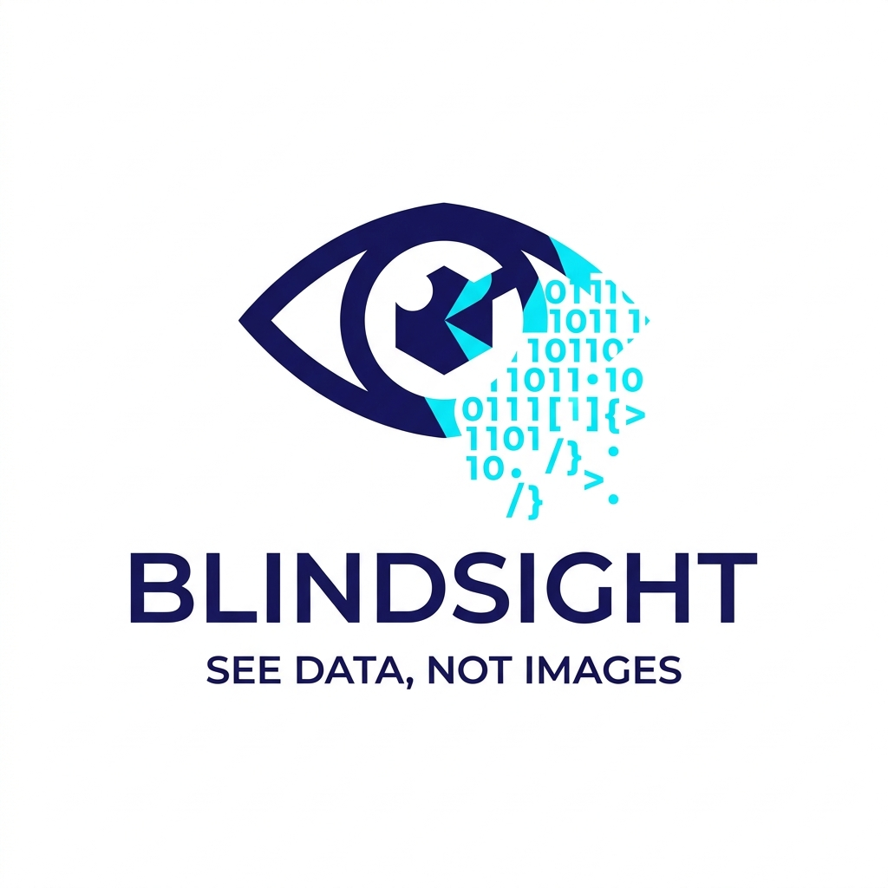

<p align="center">
  
</p>

<p align="center">
  <a href="#benchmark"></a>
</p>

# Blindsight

Turn any image into a compact, structured **text descriptor** using classical
image processing — no AI, no ML model downloads, no GPU. The output is designed
to give a text-first language model enough factual context to answer questions
about an image without paying to send the full image.

> **Blindsight** is a neurological condition in which people with damage to the
> visual cortex respond accurately to visual stimuli they report not consciously
> seeing — their brain processes the signal without the experience of sight.
> That is exactly what this tool does for a language model: it extracts real,
> actionable information from an image the model never actually *sees*.

```
$ blindsight photo.jpg

=== IMAGE DESCRIPTOR ===
source: photo.jpg
size: 640x360
modules: 8/8 available

[Stats]
  resolution: 640x360
  orientation: landscape
  aspect_ratio: 16:9
  brightness: bright
  contrast: high

[OCR]
  text: "Welcome to Hyderabad SALE 50% Off"
  confidence: 95.8% (reliable)
  position: top-center
  size: large

[Colors]
  dominant: white #F0F5FA (62%), navy blue #1A3C5E (19%), red #DC1E1E (6%)
  grid:
    TL:navy blue  TC:navy blue  TR:navy blue
    ML:light gray MC:white      MR:beige
    BL:white      BC:white      BR:light gray
  grayscale: false

[Structure]
  edge_density: low
  lines: horizontal=true, vertical=true, diagonal=false
  layout: structured

[Shapes]
  count: 3
  - rectangle, large, left
  - circle, medium, right
  - blob, small, top-center

[Faces]
  count: 0

[Codes]
  none

[EXIF]
  none

=========================
```

## Why this project

Sending a full image to a multimodal model is accurate but expensive, and
text-only models can't accept images at all. Yet a large share of real questions
about images are **factual, not perceptual**: *what does this screenshot say?*,
*what URL is in this QR code?*, *what are the brand colours?*, *how many
people?* Those answers live in symbolic facts that text carries perfectly — no
pixels required.

Blindsight extracts exactly those facts and hands them to the model as plain
text. Two payoffs:

- **Cost and latency.** A short text descriptor is a fraction of the token cost
  of a full image. For the factual subset of questions, you skip vision entirely
  and still get the right answer.
- **Reach.** Text-only models (and cheap text endpoints) gain a usable, if
  limited, way to "answer about" images they fundamentally cannot ingest.

It is deliberately honest about its limits — it does not pretend to *see* a
scene. The design intent is a cheap first pass: try the descriptor, and fall
back to the real image only when the question is genuinely perceptual. The
included [benchmark](#benchmark) exists to measure exactly where that line sits.

## What it extracts

| Module      | Output                                                            |
|-------------|-------------------------------------------------------------------|
| `stats`     | resolution, orientation, aspect ratio, brightness, contrast       |
| `ocr`       | text in reading-order lines, confidence, position, size *(optional)* |
| `colors`    | dominant + accent palette (hex + name), 3×3 colour grid, grayscale |
| `structure` | edge density, dominant line orientations, layout character        |
| `shapes`    | object count, shape class, size, position                         |
| `faces`     | face count and rough positions (classical Haar cascades)          |
| `codes`     | QR / barcode values                                               |
| `exif`      | capture date, device, GPS presence, orientation                   |

## Install

Requires **Python 3.10–3.13** (3.14 currently lacks prebuilt OpenCV wheels).

```bash
python3.12 -m venv .venv
source .venv/bin/activate
pip install -r requirements.txt
```

The OCR module additionally needs the system Tesseract binary:

```bash
# macOS
brew install tesseract
# Ubuntu / Debian
sudo apt-get install tesseract-ocr
```

OCR is optional — without Tesseract every other module still runs, and the OCR
section is reported as `unavailable` rather than failing.

## Usage

### Command line

```bash
# Full descriptor to stdout
python blindsight.py photo.jpg

# JSON instead of text
python blindsight.py photo.jpg --format json

# Only specific modules
python blindsight.py photo.jpg --modules ocr,colors,codes

# Write to a file
python blindsight.py photo.jpg --output descriptor.txt
```

If installed (`pip install -e .`) the `blindsight` command and `python -m blindsight`
work the same way.

### Library

```python
from blindsight import extract

descriptor = extract("photo.jpg")
print(descriptor.to_text())      # LLM-friendly text block
data = descriptor.to_json()      # structured dict

ocr = descriptor.get("ocr")
if ocr.available:
    print(ocr.data["text"])
```

## Benchmark

`benchmark/run_benchmark.py` measures the actual point of the project: how well
a text model answers questions from the descriptor alone versus from the real
image. It generates descriptors and ready-to-paste evaluation packets for a
folder of images — no model API key required.

```bash
python benchmark/run_benchmark.py --images ./images --out benchmark/out \
    --questions questions.json
```

`questions.json` maps each image filename to its ground-truth questions:

```json
{
  "receipt.jpg": ["What is the total?", "What store is this?"],
  "chart.png":   ["How many bars are shown?"]
}
```

For each image you get a `*.descriptor.txt` and a `*.packet.txt`. Feed the
packets to your text model, feed the real images to a multimodal model as the
control, and score both against your ground truth. `benchmark/make_test_sheet.py`
turns the ground truth into a gradeable `scorecard.csv`, `benchmark/score.py`
tallies it, and `benchmark/token_savings.py` reports the cost side with no API
key. See [`benchmark/README.md`](benchmark/README.md) for the full loop.

### Results

Run on the eleven showcase images (36 questions), graded with GPT-5 mini once on
the descriptor text alone (condition A) and once on the real image (condition B):

| Question type | Descriptor (text) | Image (control) |
|---|---|---|
| **Factual** (what does it say / what value / how many) | **89%** | 94% |
| **Perceptual** (mood, scene meaning, expression, landmark) | 11% | 100% |

So on the factual subset the text descriptor recovers ~95% of full-vision
accuracy while using **~52% fewer input tokens** (per `token_savings.py`), and on
perceptual questions it honestly defers rather than guessing — which is the
signal to fall back to the real image.

One case is worth singling out: for *"what URL does this QR code contain?"* the
descriptor **beat** the multimodal model (1.0 vs 0.0), because Blindsight decodes
the code with OpenCV while a vision model cannot read a QR from pixels alone. The
classical decoder, handed over as cheap text, is exactly the point.

These numbers are a single graded pass on a small, deliberately varied set, not a
statistical benchmark — reproduce them with your own images and model via the
loop above.

## Design notes

- **Graceful degradation.** A missing dependency or a failing module never
  aborts extraction; it is reported as `unavailable` with a reason.
- **Few system dependencies.** QR decoding uses OpenCV's built-in detector
  rather than zbar. Dominant colours use Pillow's quantiser rather than an extra
  library. Tesseract is the only optional system dependency.
- **Named colours.** Every colour ships with both a hex code and a
  human-readable name, since the name is what a language model reasons with most
  reliably.
- **Adaptive thresholds.** Edge detection derives its thresholds from each
  image's own intensity, so it adapts to dark and bright images alike.

## What it deliberately won't do

- Interpret scene meaning, mood, or narrative ("a man running from a dog").
- Identify specific people, brands (beyond OCR), or landmarks.
- Reliably read handwriting or heavily stylised fonts.
- Detect non-frontal faces consistently (Haar cascades miss many profiles).

These are the signals that the descriptor is *insufficient* and the real image
should be sent instead.

## Tests

```bash
pip install pytest
python -m pytest tests/
```

## License

MIT
