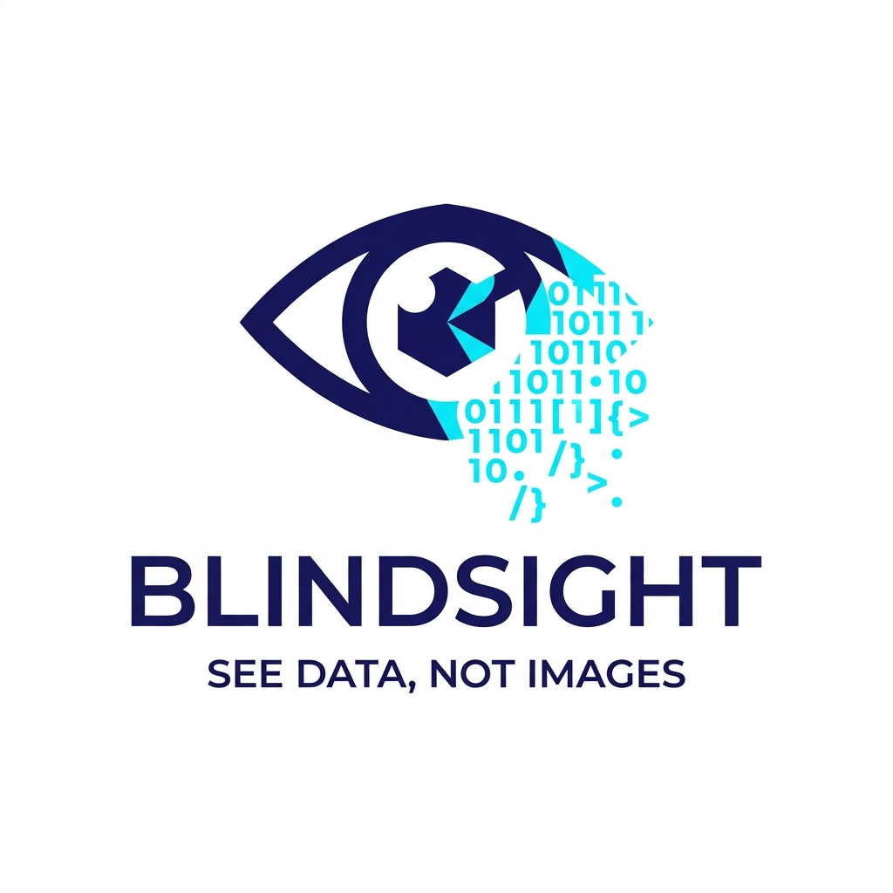

<p align="center">  </p>

<p align="center"> <a href="#benchmark"></a> </p>

# Blindsight

Turn any image into a compact, structured **text descriptor** using classical image processing — no AI, no ML model downloads, no GPU. The output is designed to give a text-first language model enough factual context to answer questions about an image without paying to send the full image.

> **Blindsight** is a neurological condition in which people with damage to the
> visual cortex respond accurately to visual stimuli they report not consciously
> seeing — their brain processes the signal without the experience of sight.
> That is exactly what this tool does for a language model: it extracts real,
> actionable information from an image the model never actually *sees*.

```
$ blindsight photo.jpg

=== IMAGE DESCRIPTOR ===
source: photo.jpg
size: 640x360
modules: 11/11 available

[Stats]
  resolution: 640x360
  orientation: landscape
  aspect_ratio: 16:9
  brightness: bright
  contrast: high

[OCR]
  text: "Welcome to Hyderabad SALE 50% Off"
  confidence: 95.8% (reliable)
  position: top-center
  size: large

[Tables]
  none

[Colors]
  dominant: white #F0F5FA (62%), navy blue #1A3C5E (19%), red #DC1E1E (6%)
  grid:
    TL:navy blue  TC:navy blue  TR:navy blue
    ML:light gray MC:white      MR:beige
    BL:white      BC:white      BR:light gray
  grayscale: false

[Regions]
  - white #F0F5FA, 64%, background, smooth
  - navy blue #1A3C5E, 19%, top-center, wide, smooth
  - red #DC1E1E, 6%, right, tall, smooth
  bands top->bottom: navy blue (0%-22%)

[Layout]
  "Welcome to Hyderabad" inside navy blue region (top-center)
  "SALE 50% Off" inside red region (right)

[Structure]
  edge_density: low
  lines: horizontal=true, vertical=true, diagonal=false
  layout: structured

[Shapes]
  count: 3
  - rectangle, large, left
  - circle, medium, right
  - blob, small, top-center

[Faces]
  count: 0

[Codes]
  none

[EXIF]
  none

=========================
```

## Why this project

Sending a full image to a multimodal model is accurate but expensive, and text-only models can't accept images at all. Yet a large share of real questions about images are **factual, not perceptual**: *what does this screenshot say?*,
*what URL is in this QR code?*, *what are the brand colours?*, *how many people?* Those answers live in symbolic facts that text carries perfectly — no pixels required.

Blindsight extracts exactly those facts and hands them to the model as plain text. Two payoffs:

- **Cost and latency.** A short text descriptor is a fraction of the token cost
of a full image. For the factual subset of questions, you skip vision entirely and still get the right answer.
- **Reach.** Text-only models (and cheap text endpoints) gain a usable, if
limited, way to "answer about" images they fundamentally cannot ingest.

It is deliberately honest about its limits — it does not pretend to *see* a scene. The design intent is a cheap first pass: try the descriptor, and fall back to the real image only when the question is genuinely perceptual. The included [benchmark](#benchmark) exists to measure exactly where that line sits.

## What it extracts

| Module      | Output                                                            |
|-------------|-------------------------------------------------------------------|
| `stats`     | resolution, orientation, aspect ratio, brightness, contrast       |
| `ocr`       | text in reading-order lines and paragraphs, confidence, position, size; extra recovery passes for small/faint, light-on-dark, and tilted text *(optional)* |
| `tables`    | ruled tables reconstructed cell by cell — rows of pipe-separated values with row/column associations intact |
| `colors`    | dominant + accent palette (hex + name), 3×3 colour grid, grayscale |
| `regions`   | coloured regions with geometry, plus relations: bands, gradients, row stacks, shared baselines/left edges with per-element sizes |
| `layout`*   | links OCR text to the region it sits in; labels baseline elements with the text below them |
| `structure` | edge density, dominant line orientations, layout character        |
| `shapes`    | object count, shape class, size, position                         |
| `faces`     | face count and rough positions (classical Haar cascades)          |
| `codes`     | QR / barcode values                                               |
| `exif`      | capture date, device, GPS presence, orientation                   |

\* `layout` is derived from the OCR and regions results after extraction; it appears only when both produced content, and cannot be selected directly.

This set is extensible: third-party packages can add their own modules to the list — see [Plugins](#plugins).

## Install

Requires **Python 3.10–3.13** (3.14 currently lacks prebuilt OpenCV wheels).

There are three install paths — pick based on what you need:

### Run it from anywhere (recommended for just using the CLI)

Want a `blindsight` command that works in any directory, in any new shell,
without activating a virtualenv or remembering where the repo lives?
Use [`pipx`](https://pipx.pypa.io) — it builds an isolated environment for
the package once and puts just the commands on your `PATH`, the same idea
as `npm install -g`:

```bash
pipx install .                # from inside this repo, one-time
pipx install ".[ocr]"         # + OCR/tables support (pytesseract)
```

```bash
cd ~/anywhere/at/all
blindsight photo.jpg          # just works — no cwd, no venv activation
blindsight-mcp                # ditto for the MCP server
```

This is also the cleanest way to register the [MCP server](#mcp-server--give-any-text-only-model-sight)
with a client, since the client launches the command from *its* working
directory, never yours — see that section for why a bare `python -m
blindsight.mcp_server` trips people up otherwise.

### Quick run, no install

Just want `python blindsight.py photo.jpg` to work from inside a checkout?

```bash
python3.12 -m venv .venv
source .venv/bin/activate
pip install -r requirements.txt        # includes pytesseract (OCR's Python side)
```

This does **not** register the `blindsight` / `blindsight-mcp` commands, and
`import blindsight` only resolves from the repo root (it's not on `sys.path`
anywhere else). For those, use `pipx` (above) or the editable install (below)
instead.

### Editable install (working on Blindsight itself)

For hacking on the source — changes take effect immediately, no reinstall:

```bash
python3.12 -m venv .venv
source .venv/bin/activate
pip install -e .              # base: stats, colors, regions, structure, shapes, codes, exif
pip install -e ".[ocr]"       # + adds pytesseract, for the ocr/tables modules
pip install -e ".[dev]"       # + pytest, to run the test suite
```

Extras compose, e.g. `pip install -e ".[ocr,dev]"`. This also gives you the
`blindsight` / `blindsight-mcp` commands and `import blindsight` from any
directory, but only while `.venv` is activated — for a command that works in
a fresh shell with no activation step, use `pipx` above instead.

### OCR's system dependency

Any install path above gives you the `pytesseract` *Python* package (if you
used the `[ocr]` extra, or `requirements.txt`), but OCR also needs the
system **Tesseract** binary — a separate install:

```bash
# macOS
brew install tesseract
# Ubuntu / Debian
sudo apt-get install tesseract-ocr
```

OCR (and the `tables` module, which depends on it) is optional end to end —
without the Python package, the system binary, or both, every other module
still runs and OCR/Tables report `unavailable` with a reason instead of
failing.

## Usage

### Command line

```bash
# Full descriptor to stdout
python blindsight.py photo.jpg

# JSON instead of text
python blindsight.py photo.jpg --format json

# Only specific modules
python blindsight.py photo.jpg --modules ocr,colors,codes

# Write to a file
python blindsight.py photo.jpg --output descriptor.txt
```

If installed (`pipx install .` or `pip install -e .`) the `blindsight` command and `python -m blindsight` work the same way — the `pipx` install works from any directory with no venv activation needed.

### Library

```python
from blindsight import extract

descriptor = extract("photo.jpg")
print(descriptor.to_text())      # LLM-friendly text block
data = descriptor.to_json()      # structured dict

ocr = descriptor.get("ocr")
if ocr.available:
    print(ocr.data["text"])
```

### MCP server — give any text-only model sight

Blindsight ships an [MCP](https://modelcontextprotocol.io) server, so models with **no vision input at all** — DeepSeek, cheap text endpoints, local models — can answer factual questions about images through any MCP-capable client. The server implements MCP's stdio transport directly on the standard library, so it adds **zero dependencies**: if Blindsight runs, the server runs.

**Install the package first.** MCP clients launch the server command directly from their *own* working directory, not this repo, so a bare `python -m blindsight.mcp_server` only resolves if `blindsight` is actually installed somewhere that interpreter can import from — not just present in a checkout you happen to be `cd`'d into.

The simplest fix is the `pipx` install from [Install](#install) above — it puts `blindsight-mcp` on `PATH` with no venv for the client to worry about. For Claude Code:

```bash
pipx install .                # or pipx install ".[ocr]"
claude mcp add blindsight -- blindsight-mcp
```

or any client that takes the standard `mcpServers` JSON (Cline, Roo, Continue, LibreChat, custom agents running DeepSeek/Qwen/Llama…):

```json
{
  "mcpServers": {
    "blindsight": {
      "command": "blindsight-mcp"
    }
  }
}
```

If you used the editable `.venv` install instead, point the client at the **venv's interpreter by absolute path** — the client does not activate your virtualenv for you, so a bare `python` on `PATH` is a common way this silently breaks:

```bash
claude mcp add blindsight -- /absolute/path/to/blindsight/.venv/bin/python -m blindsight.mcp_server
```

```json
{
  "mcpServers": {
    "blindsight": {
      "command": "/absolute/path/to/blindsight/.venv/bin/python",
      "args": ["-m", "blindsight.mcp_server"]
    }
  }
}
```

Either way, to also load [third-party plugin modules](#plugins) in the server, set `BLINDSIGHT_ENABLE_PLUGINS=1` in the client's `env` block for this server.

Four tools, designed as a loop rather than a single shot:

| Tool | What it does |
|---|---|
| `describe_image` | Full descriptor for a path, URL, data URI, or base64 image — the first call for any image |
| `read_text` | Document-shaped deep read: OCR in reading order with paragraph breaks, plus ruled tables cell by cell |
| `inspect_region` | Re-runs extraction on one region *at full original resolution* — the model's way to "zoom in" on low-confidence text or small detail |
| `capabilities` | What's installed (e.g. whether Tesseract is present) and how to combine the tools |

The zoom loop is the part that pushes past a single descriptor: the overview honestly flags what it couldn't read (low OCR confidence, small regions), and the model calls `inspect_region` on exactly that area — where the crop gets the original image's full resolution instead of the downscaled working copy. Tool descriptions tell the model to say "this needs a vision model" for perceptual questions instead of guessing, keeping the project's honesty contract intact end to end.

## Plugins

Third-party packages can register additional extraction modules without
forking Blindsight, through a standard Python entry point — install a
plugin package alongside Blindsight and it becomes available under
`--enable-plugins`.

A plugin package declares its modules under the `blindsight.modules` group
in its own `pyproject.toml`:

```toml
[project.entry-points."blindsight.modules"]
my_module = "my_package.my_module"
```

The dotted path must resolve to an object satisfying the same module
contract every built-in module follows — `NAME`, `TITLE`, `run(ctx)`,
`render(data)` (see [`CLAUDE.md`](CLAUDE.md#the-module-contract) for the
exact shape). Once such a package is installed in the
same environment, opt into loading it — plugins are **off by default
everywhere**, since loading one means running arbitrary third-party code:

```bash
python blindsight.py photo.jpg --enable-plugins
```

```python
from blindsight import extract
descriptor = extract("photo.jpg", enable_plugins=True)
```

```bash
BLINDSIGHT_ENABLE_PLUGINS=1 python -m blindsight.mcp_server   # MCP server
```

Plugins always run *after* every built-in module — the built-in output
order stays exactly as deliberate as it always was (see `REGISTRY` in
`blindsight/modules/__init__.py`) — and a plugin cannot claim a `NAME`
already used by a built-in module or another plugin. A plugin that fails
to import or doesn't match the contract is skipped with a warning: one
bad plugin never breaks discovery of the others, or of the built-ins,
following the same graceful-degradation contract every built-in module
already honors for its own failures.

## Benchmark

`benchmark/run_benchmark.py` measures the actual point of the project: how well a text model answers questions from the descriptor alone versus from the real image. It generates descriptors and ready-to-paste evaluation packets for a folder of images — no model API key required.

```bash
python benchmark/run_benchmark.py --images ./images --out benchmark/out \
    --questions questions.json
```

`questions.json` maps each image filename to its ground-truth questions:

```json
{
  "receipt.jpg": ["What is the total?", "What store is this?"],
  "chart.png":   ["How many bars are shown?"]
}
```

For each image you get a `*.descriptor.txt` and a `*.packet.txt`. Feed the packets to your text model, feed the real images to a multimodal model as the control, and score both against your ground truth. `benchmark/make_test_sheet.py` turns the ground truth into a gradeable `scorecard.csv`, `benchmark/score.py` tallies it, and `benchmark/token_savings.py` reports the cost side with no API key. See [`benchmark/README.md`](benchmark/README.md) for the full loop.

### Results

Run on the eleven showcase images (36 questions), graded with GPT-5 mini once on the descriptor text alone (condition A) and once on the real image (condition B):

| Question type | Descriptor (text) | Image (control) |
|---|---|---|
| **Factual** (what does it say / what value / how many) | **93%** | 94% |
| **Perceptual** (mood, scene meaning, expression, landmark) | 11% | 100% |

So on the factual subset the text descriptor recovers ~99% of full-vision accuracy while using **32% fewer input tokens** (per `token_savings.py`), and on perceptual questions it honestly defers rather than guessing — which is the signal to fall back to the real image.

One case is worth singling out: for *"what URL does this QR code contain?"* the descriptor **beat** the multimodal model (1.0 vs 0.0), because Blindsight decodes the code with OpenCV while a vision model cannot read a QR from pixels alone. The classical decoder, handed over as cheap text, is exactly the point.

These numbers are a single graded pass on a small, deliberately varied set, not a statistical benchmark — reproduce them with your own images and model via the loop above.

## Design notes

- **Graceful degradation.** A missing dependency or a failing module never
aborts extraction; it is reported as `unavailable` with a reason.
- **Few system dependencies.** QR decoding uses OpenCV's built-in detector
rather than zbar. Dominant colours use Pillow's quantiser rather than an extra library. Tesseract is the only optional system dependency.
- **Named colours.** Every colour ships with both a hex code and a
human-readable name, since the name is what a language model reasons with most reliably.
- **Adaptive thresholds.** Edge detection derives its thresholds from each
image's own intensity, so it adapts to dark and bright images alike.
- **Recovery passes, gated by evidence.** Hard text images get targeted extra
OCR passes — binarised for small/faint text, inverted for light-on-dark (slides, terminals), deskewed for tilted scans. A pass only wins by scoring strictly higher on total word confidence, and a pass that starts from *zero* first-pass words must clear a stronger bar (several words at solid confidence), so a photo with no text can never gain hallucinated text from the extra attempts.
- **Ruled tables, reconstructed — aligned columns, left alone.** Tables carry
the densest facts an image can hold, and flat OCR destroys exactly the row/column associations they depend on. The `tables` module finds ruling lines morphologically, rebuilds the cell grid, and buckets one OCR pass's words into cells — but only when the grid is *drawn*: at least three lines each way, spanning, actually crossing, with text-sized cells. Whitespace-only column alignment is deliberately not inferred; inventing an invisible grid is the kind of unmeasured structure this project refuses to emit.
- **Symbolic geometry, not ASCII art.** The obvious way to give a text model
"sight" is to rasterise the image into a character grid — and it fails twice: token count scales with pixel count, and BPE tokenisation destroys the 2D alignment the picture depends on. The `regions` module takes the opposite route: segment the image classically and ship a handful of *measured facts* (region colours, positions, full-width bands, repeated row stacks, elements sharing a baseline with their heights). On a bar chart it emits `baseline: 4 elements aligned at y=86% — left→right: blue h=29%, orange h=48%, green h=39%, red h=66%`, which lets a text model answer *which bar is tallest* — a question type even multimodal models get wrong on precise values — with no chart-specific parser, in a dozen tokens. The module only measures; interpreting "blue band over green band" as *sky over grass* is left to the model, which is exactly what it is good at.

## What it deliberately won't do

- Interpret scene meaning, mood, or narrative ("a man running from a dog").
- Identify specific people, brands (beyond OCR), or landmarks.
- Reliably read handwriting or heavily stylised fonts.
- Detect non-frontal faces consistently (Haar cascades miss many profiles).

These are the signals that the descriptor is *insufficient* and the real image should be sent instead.

## Tests

```bash
pip install pytest
python -m pytest tests/
```

Beyond unit tests, `tests/test_random_property.py` is a property-based suite: each test draws random instances of an image *family* (bar charts, horizontal bars, gradients, UI row layouts, flat/noise images) from seeded RNGs and asserts that the regions module recovers counts, orderings and proportions — and invents no structure on featureless images. New seeds are new images, so the suite tests the families, not a fixed set of pictures. CI runs it on every push.

## License

MIT
